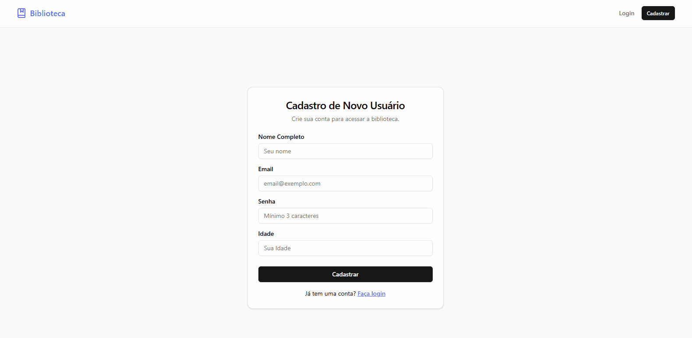
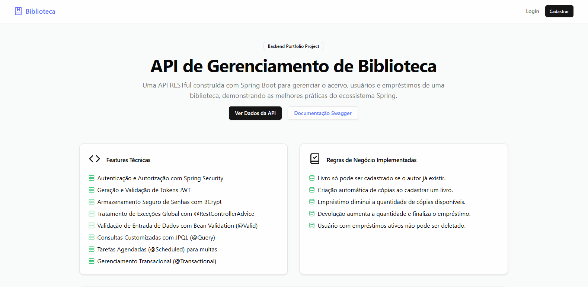
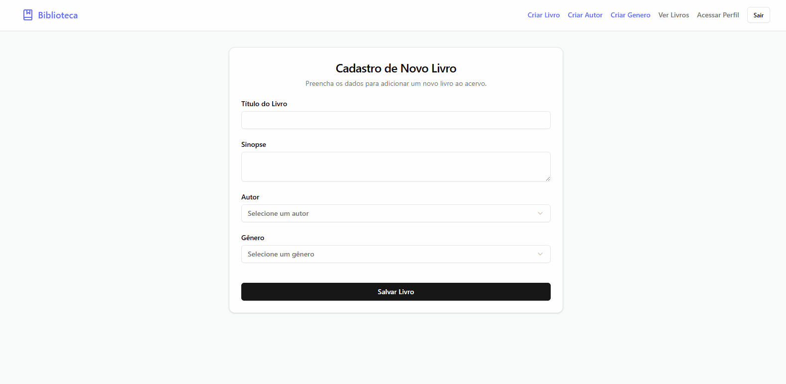
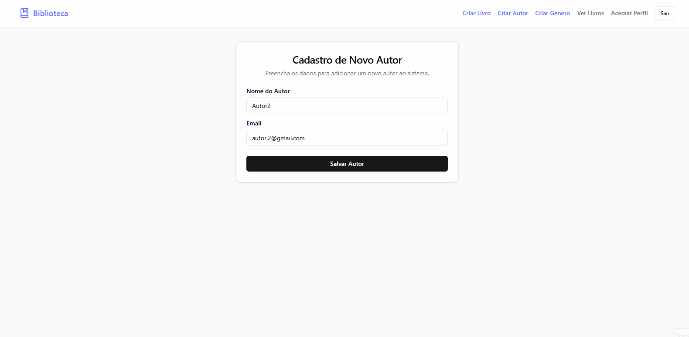
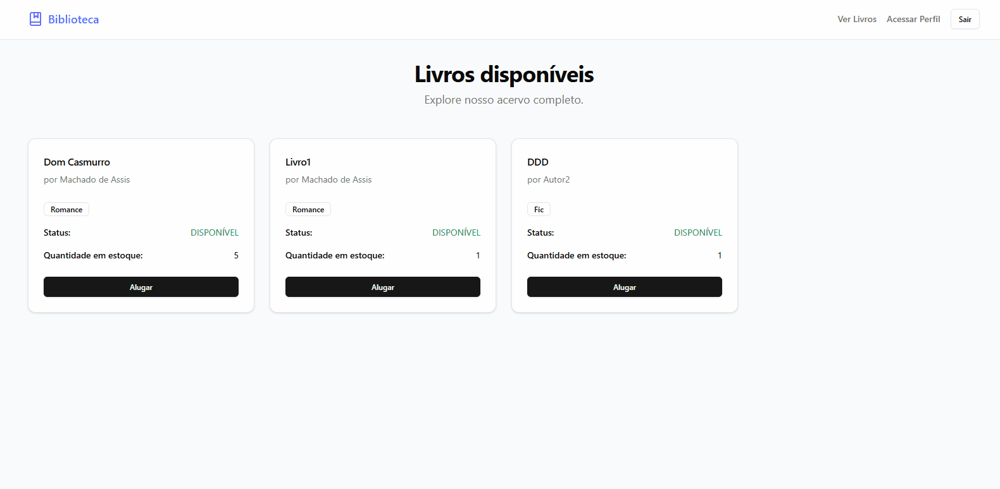
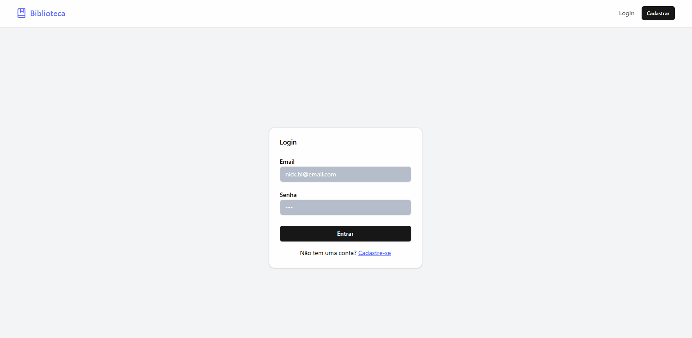
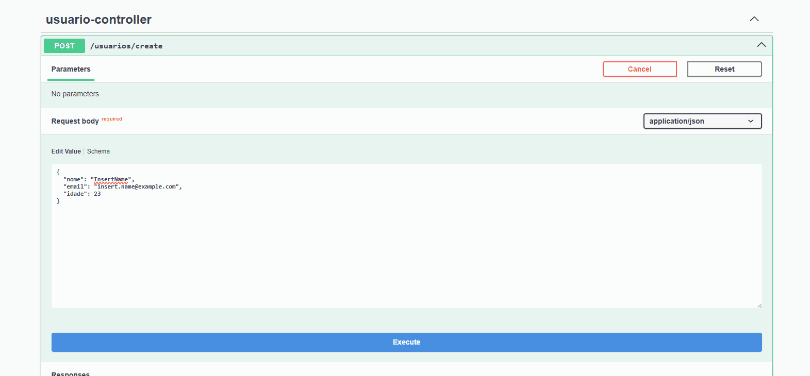
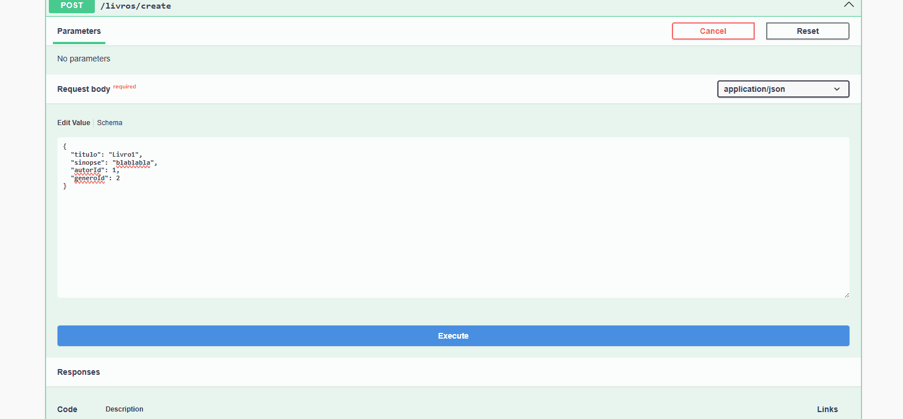
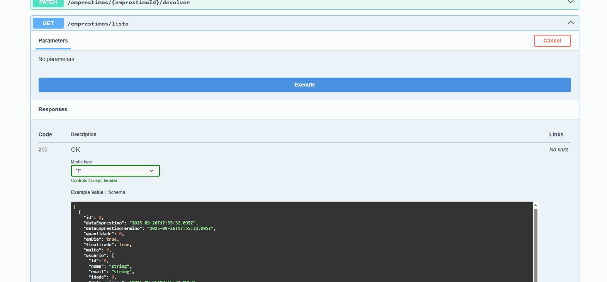
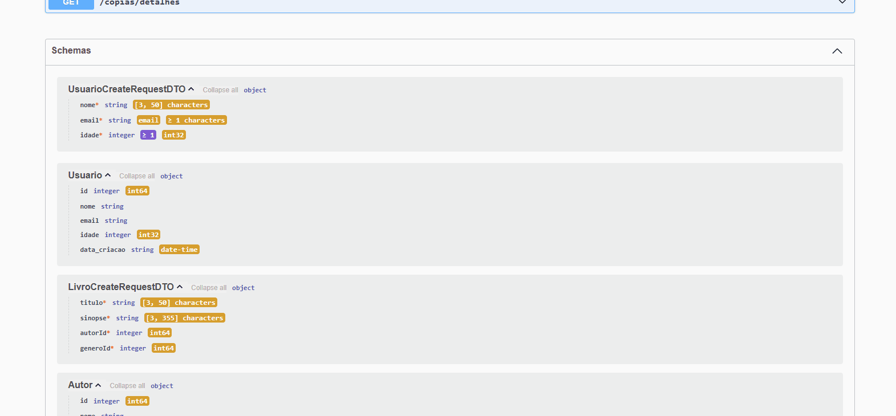

# 📚 API de Gerenciamento de Biblioteca (Biblioteca-Spring)

API RESTful construída com Spring Boot para gerenciar o acervo, usuários e empréstimos de uma biblioteca. Este projeto foi desenvolvido como uma peça de portfólio para demonstrar habilidades no ecossistema Spring e na construção de backends robustos e seguros.


---

## 🖥️ Demonstração do Front-End

Além da API, um front-end foi desenvolvido para consumir os dados e proporcionar uma interface de usuário completa. Abaixo estão as demonstrações das principais funcionalidades:

#### Cadastro e Login de Usuários


#### Página Inicial e Navegação Geral


#### Criação de Livros


#### Cadastro de Autores e Gêneros


#### Fluxo de Empréstimo e Devolução


#### Demonstração de Paginação


---

## 🚀 Demonstração da API (Endpoints)

As animações abaixo demonstram os principais fluxos da API sendo testados via cliente HTTP.

| **Endpoints de Usuários (CRUD)** | **Endpoints de Livros (com DTO)** |
| :---: | :---: |
|  |  |
| **Endpoints de Empréstimos (Regras de Negócio)** | **Estrutura do Banco e DTOs** |
|  |  |

---

## ✨ Features e Regras de Negócio

Este projeto implementa uma série de funcionalidades e conceitos importantes no desenvolvimento de APIs:

#### Features Técnicas
- **Tratamento de Exceções Global:** Uso de `@RestControllerAdvice` para capturar exceções e retornar respostas de erro JSON padronizadas e limpas.
- **Validação de Entrada de Dados:** Utilização de Bean Validation (`@Valid`) nos DTOs para garantir a integridade dos dados na entrada da API.
- **Consultas Customizadas com JPQL:** Queries otimizadas com `@Query` para buscar dados complexos e projetá-los em DTOs específicos para relatórios.
- **Métodos de Consulta Derivados:** Uso do poder do Spring Data JPA para criar consultas complexas diretamente a partir da assinatura dos métodos no repositório.
- **Tarefas Agendadas (`@Scheduled`):** Um processo automático que verifica empréstimos atrasados e aplica multas, simulando um "cron job" no backend.
- **Gerenciamento Transacional (`@Transactional`):** Garante a consistência dos dados em operações de negócio que envolvem múltiplas alterações no banco.

#### Segurança e Autenticação (Spring Security)
- **Controle de Acesso por Perfil:** Acesso a endpoints separado por perfis (`ROLE_ADMIN`, `ROLE_USER`).
- **Endpoints Públicos:** Rotas de Login (`/login`) e Cadastro de Usuário (`/usuarios`) são públicas para permitir a autenticação e o registro de novos usuários.
- **Acesso Restrito para Usuários:** A visualização de livros é permitida para o perfil `ROLE_USER`.
- **Acesso Restrito para Administradores:** A deleção de usuários é uma rota restrita ao perfil `ROLE_ADMIN`, protegendo operações críticas.

#### Regras de Negócio Implementadas
- Um livro só pode ser cadastrado se o autor já existir no sistema.
- Ao cadastrar um livro, uma cópia com quantidade padrão é criada automaticamente.
- A criação de um empréstimo diminui a quantidade disponível da cópia correspondente. Se a quantidade chegar a zero, o status da cópia muda para `INDISPONÍVEL`.
- A devolução de um item de empréstimo aumenta a quantidade disponível da cópia e, se for o caso, finaliza o empréstimo.
- Um usuário não pode ser deletado se possuir empréstimos ativos (não finalizados), garantindo a integridade referencial dos dados.

---

## 🛠️ Stack de Tecnologias

* **Linguagem:** Java 17
* **Framework:** Spring Boot 3
* **Segurança:** Spring Security 6
* **Persistência:** Spring Data JPA / Hibernate
* **Banco de Dados:** PostgreSQL
* **Build Tool:** Maven
* **Documentação:** Springdoc OpenAPI (Swagger)

---

## ⚙️ Configuração e Execução

Siga os passos abaixo para executar o projeto localmente.

#### Pré-requisitos
- Java JDK 17 ou superior
- Apache Maven 3.8 ou superior
- PostgreSQL
- Um cliente de API como [Postman](https://www.postman.com/) ou [Insomnia](https://insomnia.rest/).

#### Passos
1.  **Clone o repositório:**
    ```bash
    git clone [https://github.com/seu-usuario/bibliotecaSpring.git](https://github.com/seu-usuario/bibliotecaSpring.git)
    cd bibliotecaSpring
    ```

2.  **Configure o Banco de Dados:**
    - Crie um banco de dados no PostgreSQL com o nome `bibliotecaDB`.
    - Verifique o arquivo `src/main/resources/application.properties` e ajuste as propriedades `spring.datasource.username` e `spring.datasource.password` de acordo com a sua configuração local do PostgreSQL.

3.  **Execute a Aplicação:**
    - Pelo terminal, na raiz do projeto, execute:
    ```bash
    mvn spring-boot:run
    ```
    - Alternativamente, importe o projeto em sua IDE (IntelliJ, Eclipse, etc.) e execute a classe principal `BibliotecaApplication`.

4.  **Acesse a Aplicação:** A API estará disponível em `http://localhost:8080`.

---

## 📄 Documentação da API (Swagger)

Toda a API está documentada e pode ser testada interativamente através do Swagger UI.

Após iniciar a aplicação, acesse a seguinte URL no seu navegador:
[**http://localhost:8080/swagger-ui.html**](http://localhost:8080/swagger-ui.html)
